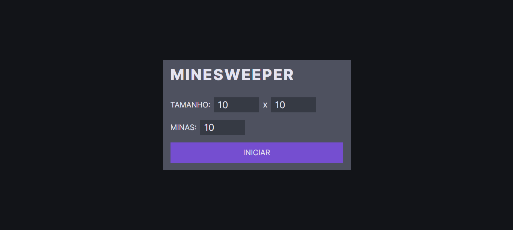
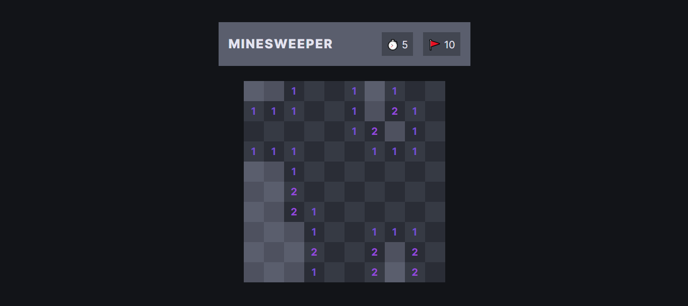
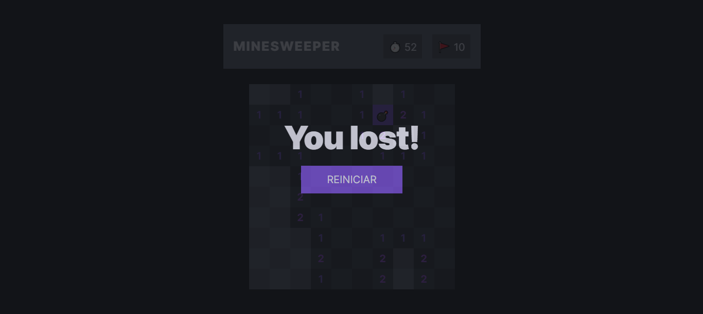

# MINESWEEPER GAME COM SVELTE
👨‍🏫O JOGO É UMA VERSÃO ONLINE DO CLÁSSICO "CAMPO MINADO" (MINESWEEPER) COM SVELTE E TYPESCRIPT.

 <br> 
 <br> 
 <br> 
 <br> 

## DESCRIÇÃO:
O jogo é uma versão online do clássico "Campo Minado" (Minesweeper), onde o objetivo é descobrir todas as células sem bombas no menor tempo possível, evitando detonar as bombas. O tabuleiro é composto por células que podem conter bombas ou serem seguras. O jogador deve usar pistas fornecidas pelas células vizinhas para determinar quais células contêm bombas e quais estão seguras. O jogo termina quando todas as células seguras são reveladas ou uma bomba é detonada.

## ESTRUTURA:
Aqui está uma breve visão geral da estrutura do projeto:

- `src/`: Este é o local onde o código principal da aplicação é armazenado. Inclui:
  - `interfaces/`: Contém interfaces TypeScript usadas no projeto.
  - `lib/`: Contém todos os componentes usados no projeto.
  - `styles/`: Contém todos os arquivos CSS.
  - `utils/`: Contém funções utilitárias como `generateMap.ts`.
  - `App.svelte`: O componente principal da aplicação.
  - `main.ts`: O ponto de entrada para a aplicação.
- `public/`: Este diretório contém arquivos estáticos.
- `index.html`: O arquivo HTML principal.

## EXECUTANDO O PROJETO:
1. **Instalar as dependências do projeto**:
   - Execute o comando no diretório `CODIGO/`:
     ```cmd
     npm install
     ```
   Este comando instala todas as dependências listadas no arquivo `package.json` do seu projeto. 

2. **Executando o Aplicativo:**
   - Ainda no diretório `CODIGO/`, abra o terminal ou prompt de comando e digite o seguinte comando:
   ```bash
   npm run dev
   ```
   - Acesse o aplicativo no navegador visitando `http://localhost::5173/`.

3. **Jogando:**
   1. **Iniciando o Jogo:**
   - Ao carregar o jogo, você verá um menu de configuração onde pode definir o tamanho do tabuleiro (largura e altura) e o número de minas.
   - Insira os valores desejados nos campos "TAMANHO" e "MINAS".
   - Clique no botão "INICIAR" para começar o jogo com as configurações escolhidas.

   2. **Explorando o Tabuleiro:**
      - Após iniciar o jogo, o tabuleiro será exibido com células fechadas.
      - Clique em uma célula para revelá-la.
      - Se a célula revelada contiver uma bomba, o jogo termina e você perde.
      - Se a célula revelada não contiver uma bomba, será exibido um número indicando quantas bombas estão adjacentes a essa célula.
      - Use as informações fornecidas pelas células vizinhas para determinar quais células estão seguras e quais podem conter bombas.

   3. **Marcando Bombas:**
      - Se você suspeitar que uma célula contém uma bomba, clique com o botão direito do mouse (ou mantenha pressionado em dispositivos móveis) para marcar a célula com uma bandeira.
      - Isso ajudará você a lembrar onde estão as bombas e evitar clicar nelas por engano.
      - Você tem um número limitado de bandeiras, portanto, use-as com sabedoria.

   4. **Vencendo o Jogo:**
      - O jogo é vencido quando todas as células seguras são reveladas e todas as bombas são marcadas com bandeiras.
      - Se você vencer, será parabenizado com uma mensagem de "Você venceu!".

   5. **Reiniciando o Jogo:**
      - Após vencer ou perder, você pode clicar no botão "Play again" para reiniciar o jogo com as mesmas configurações ou alterá-las no menu de configuração.
   
## NÃO SABE?
- Entendemos que para manipular arquivos em `HTML`, `CSS` e outras linguagens relacionadas, é necessário possuir conhecimento nessas áreas. Para auxiliar nesse aprendizado, oferecemos cursos gratuitos disponíveis:
* [CURSO DE SCSS](https://github.com/VILHALVA/CURSO-DE-SCSS)
* [CURSO DE TYPESCRIPT](https://github.com/VILHALVA/CURSO-DE-TYPESCRIPT)
* [CURSO DE NODEJS](https://github.com/VILHALVA/CURSO-DE-NODEJS)
* [CURSO DE SVELTE](https://github.com/VILHALVA/CURSO-DE-SVELTE)
* [CONFIRA MAIS CURSOS](https://github.com/VILHALVA?tab=repositories&q=+topic:CURSO)

## CREDITOS:
- [VEJA O VIDEO DESSE PROJETO](https://youtu.be/ODdOByJy4bc?si=pfKavr771qZDbGcP)
- [VEJA A PLAYLIST DE PROJETOS](https://youtube.com/playlist?list=PLVGpQnv1Jm4zF85nLVJU2hvqg3CBa6QQd&si=64Ou6dIY4dYhOlEd)
- [PROJETO CRIADO PELO "Kan-A-Pesh"](https://github.com/Kan-A-Pesh/svelte-minesweeper)
- [PROJETO FEITO E EDITADO PELO VILHALVA](https://github.com/VILHALVA)

